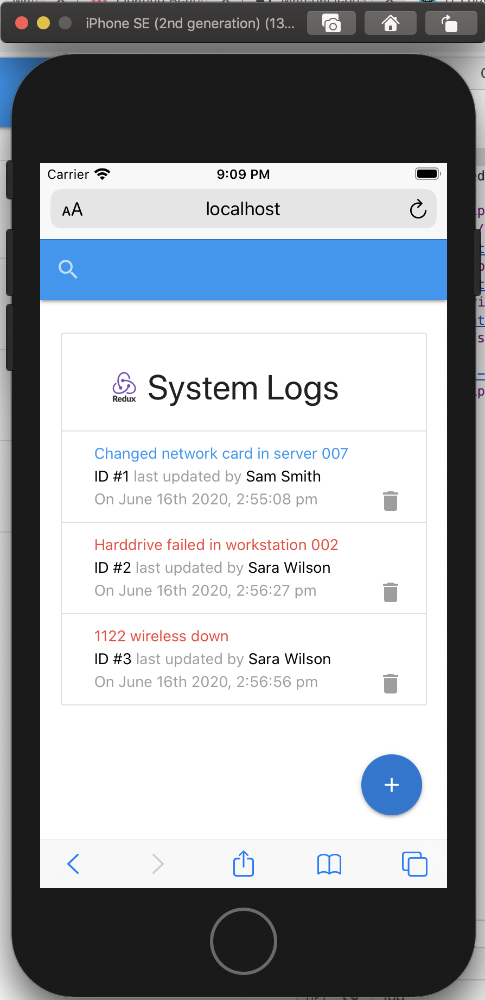
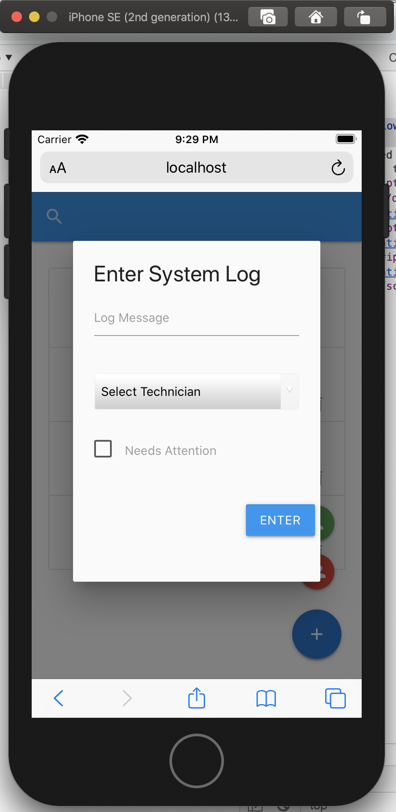
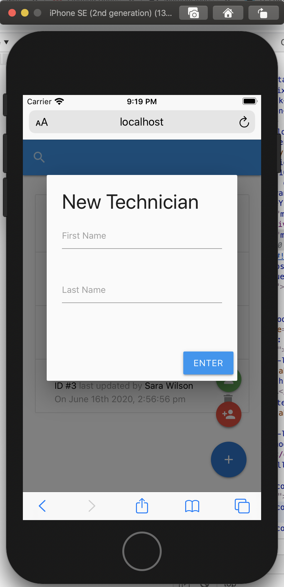
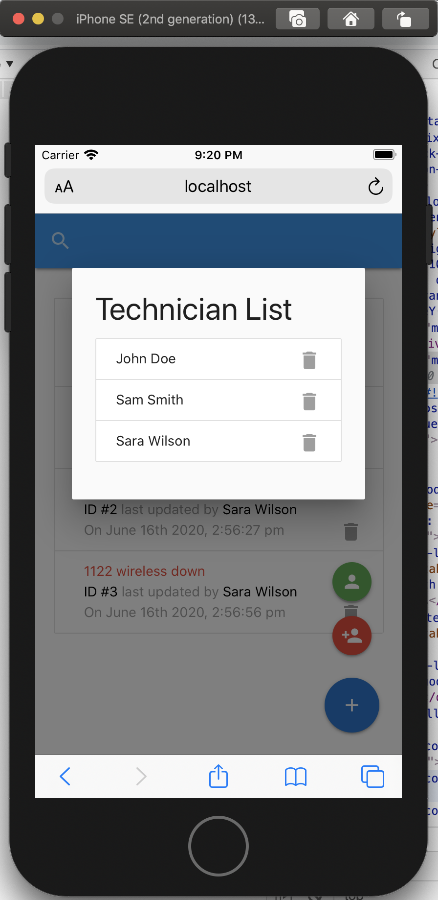
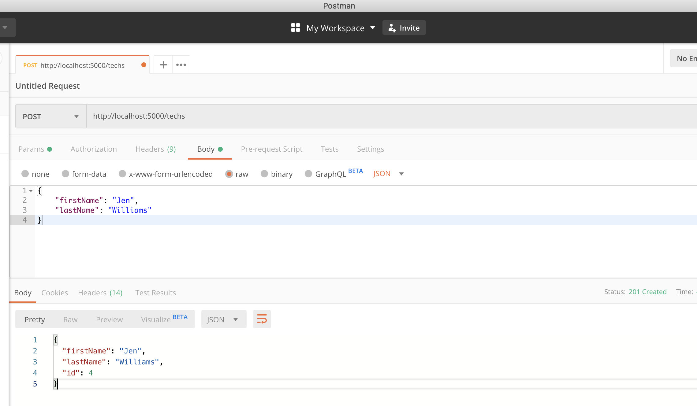

# it-logger-redux-v2

<table>
  <tr>
    <td>Main Page</td>
    <td>Add Log</td>
    <td>Add Tech</td>
    <td>Tech List</td>
  </tr>
  <tr>
    <td></td>
    <td></td>
    <td></td>
    <td></td>
  </tr>
 </table>

 *screenshots of XCode Simulator: iPhone SE 2nd Gen*

## Run the app
- `npm install`
- `npm run dev`

## Dependencies/Setup
- `npx create-react-app .`
- `npm i -D json-server concurrently` <!-- dev dependencies: json-server: a fake REST API; concurrently: runs both server and frontend -->
- add to package.json scripts: `"json-server": "json-server --watch db.json --port 5000",` and `"dev": "concurrently \"npm start\" \"npm run json-server\"",` <!-- setting mock database as db.json file -->
- setup `proxy` by adding `, "proxy": "http://localhost:5000"` to `package.json` <!-- to shorten routes in code, i.e. "/" vs "http://localhost:5000/" -->
- `npm i materialize-css` <!-- less code / lightweight compared to material-ui; quick css setup -->
- `npm i moment react-moment` <!-- process dates -->
- `npm i redux react-redux redux-thunk redux-devtools-extension`
<!-- redux: state management library; react-redux: allows redux to work with react; redux-thunk: middleware that allows async functions inside actions, so we can wait for a response, then dispatch to reducer; redux-devtools-extension: for chrome redux dev tools -->

## Redux Basics


*Redux maintains the state of an entire application in a single immutable state tree (object), which can’t be changed directly. When something changes, a new object is created (using actions and reducers).* [Smashing Magazine](https://www.smashingmagazine.com/2016/06/an-introduction-to-redux/)

- wrap entire `App.js`'s return with `<Provider store={store}></Provider>`
- unlike React's `useContext`, we don't have to bring in different contexts separately; Redux has a central store
- `src/store.js`
- `src/reducers` contains `index.js` which points to all the reducers
- `src/actions` contains actions and `types.js`

To add a functionality using Redux...
(for example, see commit "add logs" from Jun 16, 2020)
1. Add action (that will dispatch to reducer)
2. Add reducer functionality, which will control the state
3. Then, connect to component 

To use in a component...
- `import { connect } from "react-redux"`
- `import { getLogs } from "../../actions/logActions"` for bringing in action(s)
- `const Logs = ({ log: { logs, loading }, getLogs }) => {...}` to bring in state/action as props
- `const mapStateToProps = (state) => ({ log: state.log })` to map state as prop
- add `PropTypes` for state and action
- `export default connect(mapStateToProps, { getLogs })(Logs)`  connects everything in the component's export
- now, `log` state and `getLogs()` action are ready to be used in this component (`Logs.js`)

## Testing routes with Postman

- mock database is in `db.json` file
- Complete CRUD functionality from `json-server`...

- GET `http://localhost:5000/logs` -> shows logs data

- GET `http://localhost:5000/techs` -> shows techs data

- POST `http://localhost:5000/techs`, Headers: Key: `Content-Type`, Value: `application/json`, Body: 
```
{
	"firstName": "Jen",
	"lastName": "Williams"
}
```
The response from `json-server` auto-add&increments the id to: 
```
{
  "firstName": "Jen",
  "lastName": "Williams",
  "id": 4
}
```
This new tech is added to the `db.json` file

- PUT `http://localhost:5000/techs/4`, Headers: Key: `Content-Type`, Value: `application/json`, Body: 
```
{
	"firstName": "CHANGED NAME",
	"lastName": "Williams"
}
```

- DELETE `http://localhost:5000/techs/4` -> deletes tech with "id": 4